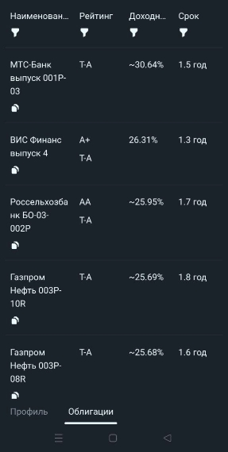

# Автоматизация инвестиций в Российские облигации

## Список облигаций

Информации по облигациям берется из 3 источников:
- API Т-Инвестиций
- API Московской Биржи (iss moex)
- Отчет собранный open source сервисом bond-finder

В веб-приложении список облигаций для неавторизованного пользователя выглядит так:

