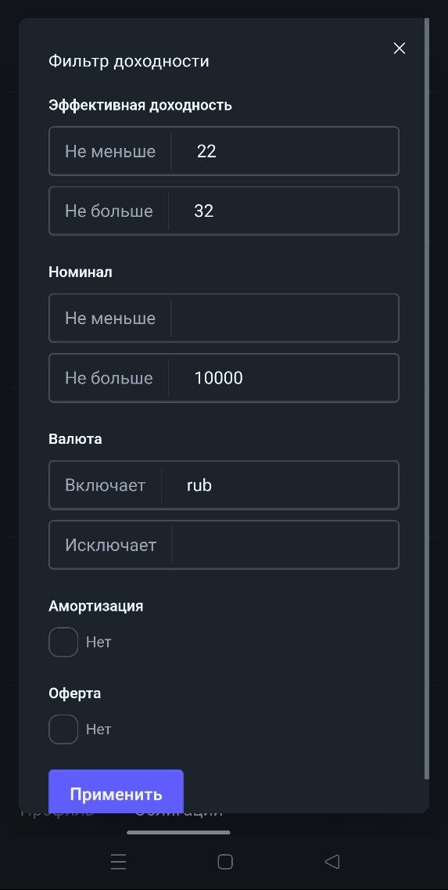

# Автоматизация инвестиций в Российские облигации

*Предыдущая статья -* [*Российские облигации, как альтернатива вкладам*](domain-paper.md)

---

Для автоматизации реализован интерфейс, который можно найти по [ссылке](https://d5d60e5fkrs2b0jc5m60.y1haggxy.apigw.yandexcloud.net/bonds) (пока доступно только веб-приложение).

## Список облигаций

Информации по облигациям берется из 3 источников:
- API Т-Инвестиций
- API Московской Биржи (iss moex)
- Отчет собранный open source сервисом bond-finder

В веб-приложении список облигаций для неавторизованного пользователя выглядит так:

В списке есть 4 столбца:
- **Наименование** - имя облигации в Т-Инвестициях, а также кнопка копирования ISIN облигации
- **Рейтинг** - рейтинг рейтингового агентства и рейтинг Т-Инвестиций
- **Доходность** - эффективная доходность облигации из расчета Московской Биржи (префикс ~ означает плавающую доходность)
- **Срок** - срок до погашения облигации в годах

По умолчанию используется консервативный фильтр с наиболее надежными облигациями, но каждый параметр можно настроить.

### Фильтрация по компаниям

Компании можно отфильтровать по сектору, аналогично Т-Инвестициям, однако фильтр можно настроить более точно:

### Фильтрация по риску

Риск можно ограничить по 3 параметрам:
- Рейтинг рейтингового агентства - от AAA до B-
- Рейтинг Т-Инвестиций - T-A (высокий), T-B (средний), T-C (низкий)
- Наличие статуса квалифицированного инвестора

### Фильтрация по доходности

Аналогично можно отфильтровать критерии влияющие на доходность:

### Фильтрация по сроку

Также можно установить удобную дату погашения, по умолчанию стоит не меньше месяца и не больше 2-ух лет:

## Инвестиции методом усреднения стоимости (DCA)

В веб-приложение можно войти под учетной записью google, тогда появится доступ к инвестициям в облигации через Т-Инвестиции. Список облигаций после авторизации выглядит так:

Как видно из скриншота появились следующие элементы интерфейса:
- **Поле вводы суммы** для инвестиций на текущий месяц
- **Флажки для выбора облигаций**, которые надо покупать (линия между флажками показывает связь облигаций, которые выпущены одним эмитентом)
- **Кнопка для запуска стратегии** инвестирования
- **Вкладка с логами** о совершенных сделках

Если нажать на кнопку DCA, то откроется форма для ввода идентификатора счета T-Инвестиций на котором будет работать стратегия, а также токена счета для совершения операций через API Т-Инвестиций:

**ID счета Т-Инвестиций** можно найти в настройках брокерского счета => Отчеты => Брокерский отчет или уточнить у поддержки (**под использование сервиса лучше завести отдельный счет**):

**API-токен счета Т-Инвестиций** можно выпустить по [ссылке](https://www.tbank.ru/invest/settings/api/) (**никому не показывайте свой токен, это секретная информация**).

Следует отметить, что ни идентификатор счета, ни токен не сохраняются на сервере и используются только во время запуска стратегии (это сделано для безопасности), поэтому чтобы каждый раз не вводить данные можно сохранить их как логин/пароль в браузере:

## Алгоритм метода усреднения стоимости

При запуске стратегии DCA происходит следующее
1. Алгоритм считывает сумму для инвестиций на месяц и вычисляет доступную сумму на сегодняшний день, а затем снимает ее из [фонда денежного рынка](https://www.tbank.ru/invest/etfs/TMON@/) на счете
2. Алгоритм получает информацию по выбранным облигациям, а также об их количестве на выбранном счете
3. Алгоритм покупает облигации таким образом, чтобы максимально приблизить облигации к балансу (т. е. в конце концов на все облигации будет потрачено равное количество денег)
4. Алгоритм переводит **все оставшиеся деньги на счете** обратно в фонд денежного рынка

Результат работы алгоритма и совершенные сделки можно посмотреть на вкладке логов:

Операции и аналитику также можно посмотреть непосредственно в приложении Т-Инвестиций.

## Заключение

Исходный код сервиса можно найти по [ссылке](https://github.com/grind-t/mini-bank). В возможных планах есть:
- Добавление собственного рейтинга компании (например, на основе модели Альтмана)
- Установка уведомлений на сильное снижение цены облигации
- Внедрение ИИ для анализа эмитента

По всем вопросам, пожеланиям и предложениям можно писать в [telegram](https://t.me/grind_t), я буду рад любой обратной связи!