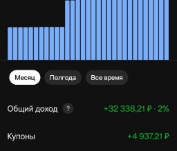
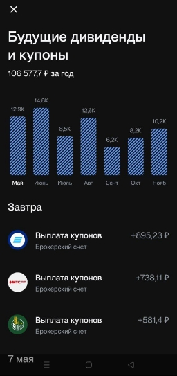

# Российские облигации, как альтернатива вкладам

## Облигация и ее ключевые параметры

Облигация, упрощенно, это кредит, выданный какой-либо организации. Ее основные параметры:
- **Доходность** - годовая доходность вложенных средств, аналогично вкладу
- **Срок** - время, на которое вы отдаете деньги, аналогично вкладу
- **Рейтинг** - вероятность банкротства организации и не выплаты ваших денег, аналогично вкладу

## Доходность облигации

На доходность облигации влияют следующие факторы:
- **Номинал** - сумма, которая вернется вам после погашения облигации
- **Рыночная цена** - сумма, за которую вы можете приобрести облигацию
- **Купон** - регулярная выплата, которую вы получаете от облигации. Он может быть **фиксированный**, например, 2% от номинала раз в 3 месяца (8% годовых) или **плавающий**, например, {ключевая ставка}% годовых

Таким образом, доходность облигации складывается из разницы номинала и рыночной цены + купонов. Если доходность рассчитывается с учетом реинвестирования получаемых выплат, ее называют **эффективной**.

Дополнительно на доходность могут влиять:
- **Амортизация** - частичное погашение номинала в течение срока облигации (вместо полного погашения номинала в конце срока)
- **Оферта** - право инвестора или **эмитента** (организации, которая выпустила облигацию) досрочно погасить облигацию по заранее оговоренной цене и в определенные даты

### Максимизация доходности

Общий алгоритм выглядит так:
1. Фильтрация и сортировка облигаций по доходности - на момент написания (04.05.2025) средняя эффективная годовая доходность облигаций c небольшим риском ~24%
2. Покупка облигаций на [ИИС](https://www.tbank.ru/invest/help/brokerage/iis/all-about-iis/what-is-it/) (до 400 000 в год) - если вы готовы держать деньги на счете 5 лет для получения налогового вычета и увеличения годовой доходности на дополнительные 13%
3. Реинвестирование купонных выплат - временное размещение выплат в фондах денежного рынка (РЕПО) и постепенная покупка новых облигаций

## Риски облигаций

На риск облигации влияет:
- [Рейтинг аналитического кредитного рейтингового агентства](https://ratings.ru/methodologies/scales/) - финансовое состояние эмитента и вероятность банкротства
- Наличие или возможность судебных разбирательств - суд может запретить эмитенту выплату денег по своим обязательствам
- Требование наличия статуса **квалифицированного инвестора** - обычно такой статус требуется для облигаций с повышенным риском или сложными условиями

### Минимизация рисков

Для минимизации рисков при покупке облигаций следует:
- Выбирать эмитентов с высоким кредитным рейтингом (например, от A)
- Проверять наличие активных судебных разбирательств у эмитентов облигаций с очень высокой доходностью
- **Диверсифицировать** активы - распределять деньги по облигациям от разных эмитентов, например, если распределить 1 000 000 по 20 разным облигациям, то в случае банкротства 1 эмитента, вы потеряете только 50 000
- Использовать **метод усреднения стоимости (DCA)** - регулярно инвестировать фиксированную сумму, чтобы не зависеть от колебаний цен на облигации и во время перестать докупать облигацию проблемного эмитента

## Статистика

Покупка 47 облигаций с минимальным рейтингом A в течение 2-ух месяцев на сумму ~1 100 000 рублей:
- Средняя месячная доходность 21 629 рублей (из них 8 900 купонная доходность)
- Годовая доходность без учета реинвестирования купонов ~23.6%
- Годовая доходность с учетом реинвестирования купонов ~24.7%

На момент написания макс. ставка по вкладу составляет 21%, т. е. облигации получаются выгоднее вклада на 3-4%.

*Общая доходность за месяц (+10 709 от фонда денежного рынка, поэтому доходность от облигаций 32 338 - 10 709 = 21 629)*

*Календарь выплат купонов*
